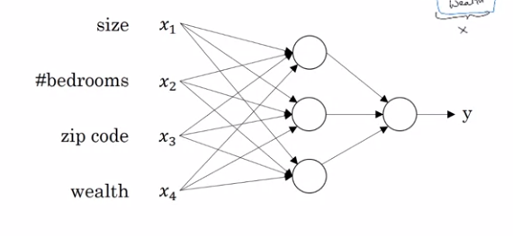
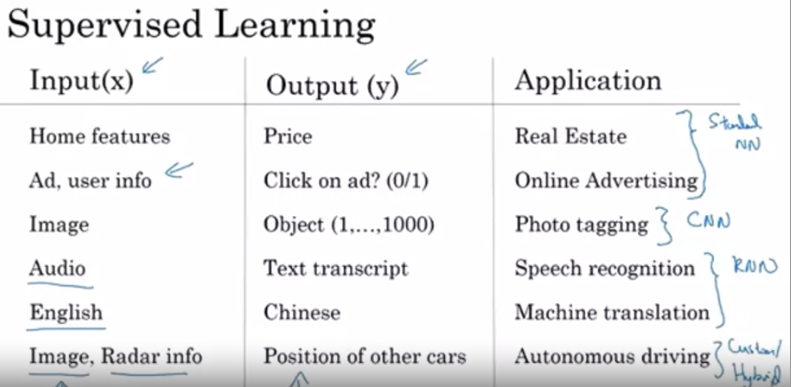

# Neural Networks and Deep Learning
## What is a neural network

- Deep learning refers "training very large neural network". 
- Each neuron performs certain operations like computing a weighted sum followed by a non-linear activation function operation such as ReLU.
- Neural network is formed by stacking multiple layer of neurons.
Example neural network is shown below.

- Input layer and hidden layer are density connected.  Every input feature is connected to every unit in the hidden layer.
- Rectified Linear Unit (ReLU) function. Rectify means taking a max of 0.

## Supervised learning
- In supervised learning, the training data you feed to the algorithm includes the desired solutions, called *labels*.
- Typical task of supervised learning: (1) classification such as spam filers and (2) regression
- Examples: (1) Linear regression, (2) Logistic Regression, (3) Support Vector Machines, Decision Trees and Random forests, (5) Neural networks
- Applications of Neural Network in supervised learning: Online Advertising, Photo tagging, Speech recognition, Machine translation, Autonomous driving

- Examples of neural networks

- Structured Data: databases of data. Each of the feature has very well defined meaning 
- Unstructued Data: Audio, Image, Text. 
- Most of the successful application of DL has been in supervised learning.

## Unsupervised learning
- In unsupervised learning, the training data is unlabeled. The system tries to learn without a teacher
- Examples: (1) Clustering, Dimension Reduction, and etc. 

## Why Deep learning is taking off?
- Scale drives deep learning process. "Scale" means both (1) labelled data & (2) size of NN.
- GPU + More Data(Digitization of data) + Algorithm advances in NN = Big Bang!
- One of the huge breakthrough in NN has been switching from SIGMOD function to ReLU function!. It's more computationally efficient!  Learning is slow in SIGMOD when gradient is nearly zero.
- Use of ReLU made the computation of gradient descent much faster.

## Logistic Regression as a Neural Network
- Logistic regression is a type of regression analysis method often used to predict the value of binary dependent variable.
- In Logistic regression, we use a logistic function to constrain the value of the dependent variable such that its value can't be smaller than 0 and bigger than 1.
- In Logistic regression, we use a logstic model to model the probability of a certain class or event existing. 
- Sigmoid function is a mathematical function having a characteristic "S"-shaped curve. Standard choice for a sigmoid function is the logicstic function whose formula is defined as S(x) = 1 / (1+e^(-x)). There are other sigmoid functinos such as arctangent function.

## Backpropagation and gradient descent.
- Training neural network consists of (1) forward propagation to get predictions (2) backpropagation to compute derivatives and (3) gradient descent update to adjust parameters.
- In forward propagation, we propagate our training set through the neural network to get our estimated labels. Then we can compute the cost function by subtracting the true labels with our estimated labels. By the way, we can't use a simply least square as a cost function since it is not convex;thus has a local minima. We need to use a convex function so that we can always reach a global minimum. 
- We use a gradient descent method to minimize our cost function. Since the cost function is a convex function, it is guaranteed to reach a global minimum with gradient descent method.

## Tips
- Always give an explicit size using reshape function. Avoid using a rank-1 array. Either use a row or column vector. You can enforce that by using `keepdims=True` parameter in numpy.
- reshape operation is O(1). 
- Another common technique we use in Machine Learning and Deep Learning is to normalize our data. It often leads to a better performance because gradient descent converges faster after normalization.
- Normalization means changing x to x/||X||. That is dividing each row vector x by its norm
- For example:  `x_norm = np.linalg.norm(x, ord=2, axis=1, keepdims=True)`

## Useful references
1. http://www.wildml.com/2015/09/implementing-a-neural-network-from-scratch/
2. https://stats.stackexchange.com/questions/211436/why-do-we-normalize-images-by-subtracting-the-datasets-image-mean-and-not-the-c
 
